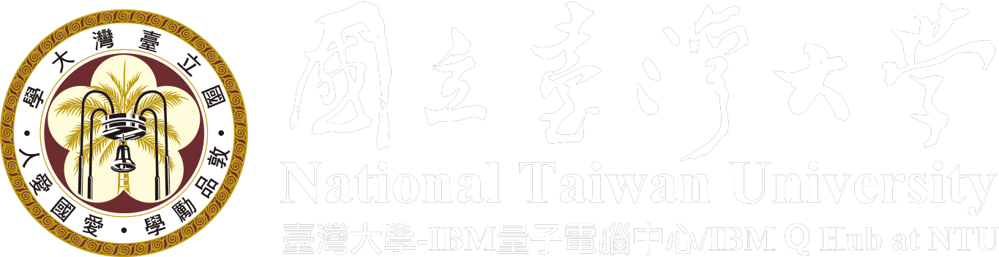

<!-- Shields: -->

[](https://www.python.org/downloads/source/)
[](https://numpy.org)
[](https://www.ibm.com/quantum/qiskit)
[](https://pytorch.org/)

<!-- Logo: -->
<div align="center">
    
</div>

<!-- Title: -->
<div align='center'>
  <h1><a href="https://quantum.ntu.edu.tw/?p=9587"> Qiskit 量子計算 Hackathon 2025</a></h1>
  <h2> Challenge: Deep Quantum Reinforcement Learning for Efficient Variational Quantum Circuits</h2>
</div>

This project uses a Proximal Policy Optimization (PPO) agent to train a quantum circuit for finding the ground state energy of a molecule (LiH) using the Variational Quantum Eigensolver (VQE) algorithm.## Introduction

This challenge focuses on leveraging deep reinforcement learning to optimize variational quantum circuits for the Variational Quantum Eigensolver (VQE) algorithm. We explored innovative approaches to feature encoding and circuit optimization, contributing to advancements in quantum computing.

## Challenge Description

The Variational Quantum Eigensolver (VQE) is a pioneering algorithm for determining the ground state of molecular systems. A key open problem in VQE is identifying an optimal quantum circuit ansatz with minimum CNOT gate count and circuit depth, while still providing accurate ground state predictions on current NISQ devices.

- **Part 1 (Fundamental):** Propose a feature encoding scheme that can be used to represent a parameterized quantum circuit in a way that is suitable for training a reinforcement learning (RL) agent. Propose the action space for the RL agent to optimize the quantum circuit ansatz. The proposed encoding should scale with the number of qubits.

  - **Skills required:** Basic understanding of quantum circuits, neural network architecture design, and data representation techniques.

- **Part 2 (Advanced):** Frame variational quantum circuit optimization within a reinforcement learning (RL) setting to find the ground-state energy of the lithium hydride (LiH) molecule `without frozen orbitals`.

  - **Skills required:** A solid foundation in reinforcement learning and experience with machine learning frameworks.

  - **Instructions:**
    1. Use the boilerplate (starter) code provided in [src/env.py](src/env.py) and complete the following helper functions and methods to implement the RL environment (e.g., state space, action space, and reward function) for an arbitrary VQE workload: [encode_circuit_into_input_embedding()](src/helper_functions/encoding.py), [decode_actions_into_circuit()](src/helper_functions/decoding.py), [compute_reward()](src/env.py), and [step()](src/env.py).
    2. Complete the actor network provided in [src/actor_critic_networks.py](src/actor_critic_networks.py).
    3. Complete the [sample_action()](src/agent.py) and [learn()](src/agent.py) methods from the agent class provided in [src/agent.py](src/agent.py).
    4. Complete the main training loop in [src/main.py](src/main.py) to train the RL agent.
    5. Benchmark your result against UCCSD or ADAPT-VQE. The RL convergence relative to FCI energy should be within $10^{-5}$.


## 🚀 Getting Started

### Prerequisites

-   Python 3.9+
-   Git

### Installation

1.  **Clone the repository:**
    ```bash
    git clone [https://github.com/YOUR_USERNAME/qiskit-hackathon-2025.git](https://github.com/YOUR_USERNAME/qiskit-hackathon-2025.git)
    cd qiskit-hackathon-2025
    ```

2.  **Install the dependencies:**
    ```bash
    pip install -r requirements.txt
    ```

## Setting Up the Development Environment

[Download](https://www.anaconda.com/download) and install Anaconda on Linux:

```bash
chmod +x <filename>.sh && ./<filename>.sh
```

### PyTorch Setup

- Create and activate the environment:

```bash
conda env create -f torch_env.yml && conda activate torch-qiskit-gpu
```

- Verify GPU:

```bash
python -c "import torch; [print(f'GPU {i}: {torch.cuda.get_device_name(i)}') for i in range(torch.cuda.device_count())]"
```

### TensorFlow Setup

- Create and activate the environment:

```bash
conda env create -f tf_gpu_env.yml && conda activate tf-qiskit-gpu
```

- Verify GPU:

```bash
python -c "import tensorflow as tf; print(tf.config.list_physical_devices('GPU'))"
```

## Running the Code

To start the training process, run the `main.py` script with the configuration file as a command-line argument:

```bash
python src/main.py src/config_lih.cfg
